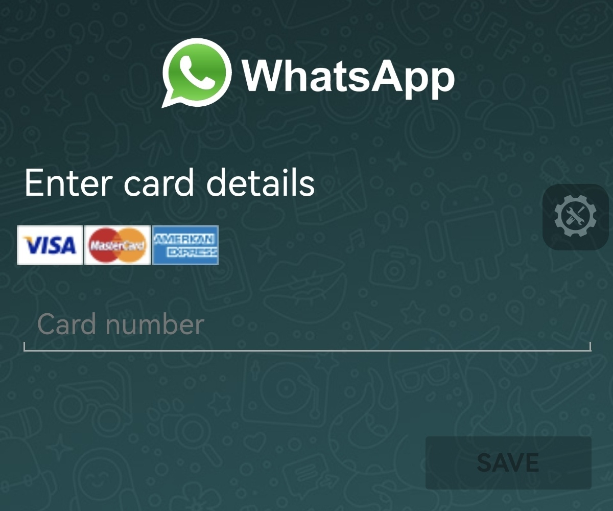
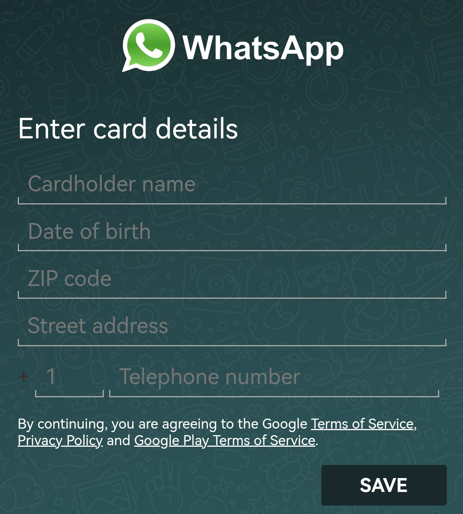

# Whatsapp-Phishing

<h3>Whatsapp Web Phishing</h3>
<h2>[⭐] What does this offer?</h2>
<h1> 1. Whatsapp phishing page </h1>
<h1> 2. Database</h1>
<h1> 3. Only real information can be entered</h1
<h1> 4. Data of the person next to bank card</h1>
<h1> 5. And the best part, is Open Source</h1>

You can edit the web as you want, the code is 100% free.

educational

<h1>DISCLAIMER: This project is for educational use, I do not take charge if any cybercrime is carried out with this repository.</h1

<h1></h1>

